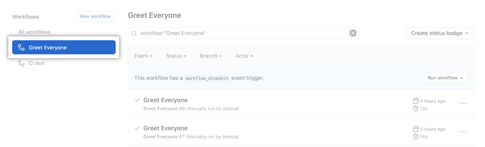
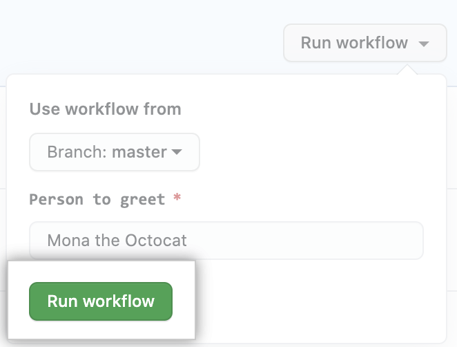

# Graasp Deploy
Deploy Graasp ecosystem in the cloud using Github workflows and Github actions. 


## Contents
- [What Graasp Deploy does](#what-graasp-deploy-does)
- [Features](#features)
    - [Continuous Integration](#continuous-integration)
    - [Continuous Delivery](#continuous-delivery)
    - [Continuous Deployment](#continuous-deployment)
- [How to](#how-to)
    - [Adding a caller workflow](#adding-a-caller-workflow)
    - [Triggering a workflow](#triggering-a-workflow)
    - [Viewing a workflow](#viewing-a-workflow)
    - [Updating environment variables (if needed)](#updating-environment-variables-if-needed)
- [Why use workflows](#why-use-workflows)
- [Why use reusable workflows](#why-use-reusable-workflows)
- [Why use Github Actions](#why-use-github-actions)

## What Graasp Deploy does
Graasp Deploy provides developers different workflows to accelerate the way they deliver code, shipping quality features to production faster.  This is achieved by adopting the CI/CD approach, which represents a radical shift from the manual way of doing things. This approach adds automation to the integration, delivery and deployment stages. 

This repository contains:
- Reusable workflows: they include the jobs that will be reused by other repositories. These jobs use Github actions to perform the required tasks. All the workflows are available inside a folder named `.github/workflows`. 
-  Caller templates: templates that references the corresponding reusable workflow. All the templates are available inside a folder named `caller-workflow-templates`. 

The workflows are divided based on the 3 different stages inside the CI/CD pipeline: continuous integration, continuous delivery and continuous deployment. Moreover, each one of these stages also contains workflows for the different distribution/delivery strategies that Graasp repositories use: AWS S3 (or S3 apps) or AWS ECS.

## Features
### Continuous Integration
Process within development that continuously builds, tests and merges new code changes. CI allows developers to deploy to the development environment. There, developers can see how new features will work and test improvements without affecting real users. 

This functionality is provided by workflows with the syntax `cintegration-*.yml`. When triggered, three jobs are run: test, build and deploy

### Continuous Delivery
Automated process that takes the validated code additions from the CI process and relases them to the stage environment. This isolated environment is as similar to the production environment as it can be, and it is where all of the hard core testing will be performed. 

This functionality is provided by workflows with the syntax `cdelivery-*.yml`. When triggered, two jobs are run: build-deploy and test. 

### Continuous Deployment
When the code is considered to be production-ready, it can be automatically deployed to the production environment.

This functionality is provided by workflows with the syntax `cdeployment-*.yml`. When triggered, one job is run: build-deploy. 

## How to
### Adding a caller workflow
Whenever you want to add a specific workflow to your repository, you should copy the appropriate caller template from `caller-workflow-templates` folder in the `.github/workflows` folder of your repository. The template should match the distribution/delivery strategy that your repository uses (AWS S3 or AWS ECS).

Then, the required inputs and secrets should be included/adapted based on the needs of the repository. 

### Triggering a workflow
Workflow triggers are events that cause a workflow to run. All the Continuous Integration workflows can be manually run from the Actions tab of your repository. 


Write access to the repository is required to perform these steps.

1. In the left sidebar, click the workflow you want to run.

    

2. Above the list of workflow runs, select Run workflow.

    

3. Use the Branch dropdown to select the workflow's branch. Click Run workflow.

    

### Viewing a workflow

After a workflow run has started, you can see a visualization graph of the run's progress and view each step's activity on GitHub.

1. In the left sidebar, click the workflow you want to see.

    

2. Under "Workflow runs", click the name of the run you want to see.

    

3. Under Jobs or in the visualization graph, click the job you want to see.

    

4. View the results of each step.

    

### Updating environment variables (if needed)
The environment variables are passed to the caller workflows as either inputs or secrets. 
Whenever you want to add a new environment variable to your repository and pass it as a secret, you should update your workflow as well. 

For this purpose, you need to perform the following steps. 
#### 1. Update inputs and secrets in a reusable workflow definition
```
on:
  workflow_call:
    inputs:
      input-variable:
        required: true
        type: string
    secrets:
      secret-variable:
        required: true
```

#### 2. Reference the input or secret that you defined in the on key in the previous step.

```
jobs:
  reusable_workflow_job:
    runs-on: ubuntu-latest
    steps:
      - uses: ./.github/workflows/...
        with:
          input-variable: ${{ inputs.input-variable }}
          secret-variable: ${{ secrets.secret-variable }}
```

#### 3. Include the secret in the caller workflow. 
- Use the `with` keyword to pass named inputs.
- Use the `secrets` keyword to pass named secrets. 
````
jobs:
  call-workflow-passing-data:
    uses: octo-org/example-repo/.github/workflows/reusable-workflow.yml@main
    with:
      input-variable: string
    secrets:
      secret-variable: ${{ secrets.SECRET_VARIABLE }}
````

#### 4. Create secrets
Create a new secret for the specific repository, with the same name you specified in the previous step.
1. Navigate to the main page of the repository. 
2. Under the repository name, click Settings

    

3. In the left sidebar, click  Secrets > Actions.

    
4. Click New repository secret.
5. Type a name for your secret in the Name input box.

    
6. Enter the value for your secret.
7. Click Add secret.

## Why use Github Actions
The use of Github Actions simplifies the automation process. Actions are similar to a plugin that comes bundled for every Github repository created, and that can execute any desired task.

Github Actions embrace five underlying concepts: jobs, workflows, events, actions and runners. 


## Why use workflows

As stated in the [Github Docs](https://docs.github.com/en/actions/using-workflows/about-workflows):

>A workflow is a configurable automated process that will run one or more jobs. Workflows are defined by a YAML file checked in to your repository and will run when triggered by an event in your repository, or they can be triggered manually, or at a defined schedule.

## Why use reusable workflows

As stated in the [Github Docs](https://docs.github.com/en/actions/using-workflows/reusing-workflows): 
>The use of reusable workflows avoids duplication and makes workflows easier to maintain. This way workflows can be created more quickly. 

The main goal for Graasp Deploy is to build up a library of reusable workflows that can be centrally maintained.


