# Graasp Deploy
Deploy Graasp ecosystem in AWS using Github workflows and Github actions. 

## Contents
- [What Graasp Deploy does](#what-graasp-deploy-does)
- [Features](#features)
    - [Continuous Integration](#continuous-integration)
    - [Continuous Delivery](#continuous-delivery)
    - [Continuous Deployment](#continuous-deployment)
    - [Update saging versions](#update-saging-versions)
- [How to](#how-to)
    - [Add caller workflows](#add-caller-workflows)
    - [Deploy to development environment](#deploy-to-development-environment)
    - [Create a new candidate for the staging environment](#create-a-new-candidate-for-the-staging-environment)
    - [Deploy a new stack to staging environment](#deploy-a-new-stack-to-staging-environment)
    - [Deploy a new stack to production environment](#deploy-a-new-stack-to-production-environment)
    - [View a workflow](#view-a-workflow)
    - [Update environment variables](#update-environment-variables)
    - [Update SHA reference of a caller workflow](#update-sha-reference-of-a-caller-workflow)
- [Why use Github Actions](#why-use-github-actions)
- [Why use workflows](#why-use-workflows)
- [Why use reusable workflows](#why-use-reusable-workflows)
- [Why refer to a fixed workflow commit](#why-refer-to-a-fixed-workflow-commit)

## What Graasp Deploy does
Graasp Deploy provides developers different workflows to accelerate the way they deliver code, shipping quality features to production faster. This is achieved by adopting the CI/CD approach, which represents a radical shift from the manual way of doing things. This approach adds automation to the integration, delivery and deployment stages. 

This repository contains:
- Reusable workflows: they include the jobs that will be reused by other repositories. These jobs use Github actions to perform the required tasks inside each of the pipelines: integration, delivery and deployment. All the workflows are available inside the `.github/workflows` folder. 
-  Caller templates: templates that references the corresponding reusable workflows. All the templates are available inside the `caller-workflow-templates` folder. To add the desired functionality to your repository, you should include the appropriate templates in the `.github/workflows` folder of your repository. For more information see [Add caller workflows](#add-caller-workflows)

The workflows are classified based on the 3 different stages inside the CI/CD pipeline: Continuous Integration, Continuous Delivery and Continuous Deployment. Moreover, each one of these stages also contains workflows for the different distribution/delivery strategies that Graasp repositories use: AWS S3 (or S3 apps) and AWS ECS.

## Features
### Continuous Integration
Process within development that continuously builds, tests and merges new code changes. CI allows developers to deploy to the development environment. There, developers can see how new features will work and test improvements without affecting real users. 

This functionality is provided by workflows with the syntax `cintegration-*.yml`. When triggered, three jobs are run: test, build and deploy. Use this workflow family whenever you want to automate the deployment of your repository to the development environment. 

### Update saging versions
When the code is considered to be production-ready, it can be promoted to the staging environment.

This functionality is provided by the `update-staging-versions.yml` workflow. Use this workflow whenever you want to automate the addition of new tags from your repository to the ecosystem staging stack in graasp-deploy. 

### Continuous Delivery
Automated process that takes the validated code additions from the previous process and relases them to the staging environment. This isolated environment is as similar to the production environment as it can be, and it is where all of the hard core testing will be performed. 

This functionality is provided by workflows with the syntax `cdelivery-*.yml`. When triggered, two jobs are run: build-deploy and test. Use this workflow family whenever you want to automate the deployment of your repository to the staging environment. 

### Continuous Deployment
When the code is considered to be ready to , it can be automatically deployed to the production environment.

This functionality is provided by workflows with the syntax `cdeployment-*.yml`. When triggered, one job is run: build-deploy. 

Use this workflow family whenever you want to automate the deployment of your repository to the production environment. 

## How to
### Add caller workflows
Whenever you want to add the graasp-deploy features to your repository, you should perform the following steps: 

1. Copy the appropriate caller templates from the graasp-deploy [caller-workflow-templates](https://github.com/graasp/graasp-deploy/tree/main/caller-workflow-templates) folder in the `.github/workflows` folder of your repository. 
    - If your repository is a graasp-app that uses AWS S3 as a distribution strategy: copy all the `*-s3-apps-caller.yml` files. 
    - If your repository uses AWS S3 as a distribution strategy: copy all the `*-s3-caller.yml` files.
    - If your repository uses AWS ECS as a distribution strategy: copy all the `*-ecs-caller.yml` files.

2. Copy the `update-staging-version.yml` file from the graasp-deploy [caller-workflow-templates](https://github.com/graasp/graasp-deploy/tree/main/caller-workflow-templates) folder in the `.github/workflows` folder of your repository. 

3. Adapt your `*-caller.yml` templates and include the required inputs and secrets. These represent the environment variables that your repository needs. The templates contain all the possible inputs and secrets that the reusable workflow can handle, but your repository might not need all of them. Feel free to remove any that are unnecessary. If you need to add a new environment variable, please see [Update environment variables](#update-environment-variables). 

4. All the secrets you include should be added to the Secrets section of your repository. For more information on how to add secrets see [4. Create secrets](#4-create-secrets). 

5. If your repository uses AWS ECS as a distribution strategy add the task definition files of your deployment to the `.aws` folder of your repository. You should include three files (one for each environment) which should be named in the following format: `<name>-<environment>.json`. These task definition files specify which container you want to run, the docker image, ports to expose, CPU to allocate, env variables and logs. You shoud include:
    - `<name>-dev.json` as an input for the `cintegration-ecs-caller.yml`. 
    - `<name>-stage.json` as an input for the `cdelivery-ecs-caller.yml`. 
    - `<name>-prod.json` as an input for the `cdeployment-ecs-caller.yml`.

After performing these steps, your repository will include all the features available in [graasp-deploy](https://github.com/graasp/graasp-deploy). For more information on this see [Features](#features). 

### Deploy to development environment
The Continuous Integration workflow (`cintegration-*.yml`) is responsible of performing the deployment to development environment. It can be manually run from the Actions tab of **your own** repository. Write access to the repository is required to perform these steps.

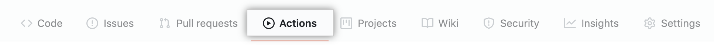

1. In the left sidebar, click the **Deploy to development environment** workflow.

    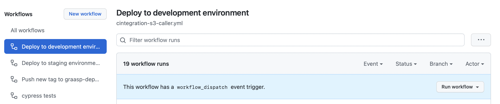

2. Above the list of workflow runs, select Run workflow.

    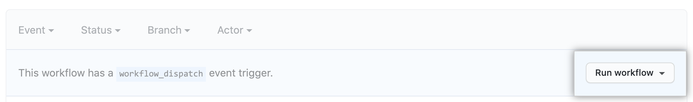

3. (Optional) Use the Branch dropdown to select a branch in case you want to deploy an specific branch. 

    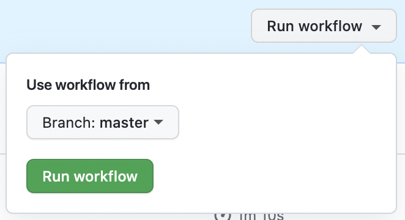

4. Finally, click on **Run workflow** and wait until the process is finished. 

### Create a new candidate for the staging environment
Whenever you want to promote a new version of your development so that it goes from development to staging environment, you should perform the following steps:
1. Open a CLI window from your repository folder
2. Run the following commands 
    ```
    git tag vA.B.C 
    git push origin --tags
    ```
3. This will automatically trigger the `update-staging-version.yml` workflow inside your repository. 

This process sends the new tag to the [graasp-deploy](https://github.com/graasp/graasp-deploy) repository and creates a new `YYYYMMddhhmm-staging-versions.json` file including the new version. 

For more information on the appropriate tag syntax, see [???]. 

### Deploy a new stack to staging environment
The Continuous Delivery workflow (`cdelivery-trigger.yml`) is responsible of deploying a new stack of all the ecosystem versions to staging environment. It can be manually run from the Actions tab of the 
[graasp-deploy](https://github.com/graasp/graasp-deploy) repository. Being a member of the **staging** team is required to perform these steps.


Whenever you want to deploy **the latest** staging stack available inside the [staging-versions](https://github.com/graasp/graasp-deploy/staging-versions) folder, you should perform the following steps:

1. In the left sidebar, click the **Deploy to staging environment** workflow.

    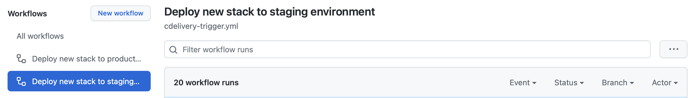

2. Above the list of workflow runs, select Run workflow.

    

3. (Optional) Use the input text field to specify a `YYYYMMddhhmm-staging-versions.json` file in case you want to deploy an specific stack. This file must be available inside the [staging-versions](https://github.com/graasp/graasp-deploy/staging-versions) folder. 

    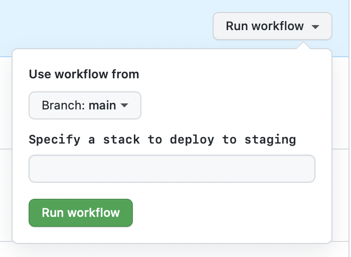

4. Finally, click on **Run workflow** and wait until the process is finished. 

This process automatically triggers all the `cdelivery-*.yml` workflows present in the repositories specified inside the `YYYYMMddhhmm-staging-versions.json` file. 
After the workflow finishes the stack (represented by the `YYYYMMddhhmm-staging-versions.json` file) will be promoted to release:
- It will be included in the `release-versions` folder
- It will be copied to the `deployed/current-staging-versions.json` file. 


### Deploy a new stack to production environment
The Continuous Deployment workflow (`cdeployment-trigger.yml`) is responsible of deploying a new stack of all the ecosystem versions to production environment. It can be manually run from the Actions tab of the 
[graasp-deploy](https://github.com/graasp/graasp-deploy) repository. Being a member of the **production** team is required to perform these steps.


Whenever you want to deploy **the latest** release stack available inside the [release-versions](https://github.com/graasp/graasp-deploy/release-versions) folder, you should perform the following steps:

1. In the left sidebar, click the **Deploy to production environment** workflow.

    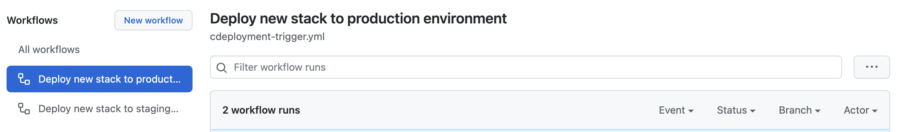

2. Above the list of workflow runs, select Run workflow.

    

3. Finally, click on **Run workflow** and wait until the process is finished. 

This process automatically triggers all the `cdeployment-*.yml` workflows present in the repositories specified inside the `YYYYMMddhhmm-release-versions.json` file. 
After the workflow finishes the stack (represented by the `YYYYMMddhhmm-release-versions.json` file) will be promoted to release:
- It will be included in the `production-versions` folder
- It will be copied to the `deployed/current-production-versions.json` file. 

### View a workflow

After a workflow run has started, you can see a visualization graph of the run's progress and view each step's activity on GitHub. For more information see Github Docs "[Viewing a workflow](https://docs.github.com/en/actions/monitoring-and-troubleshooting-workflows/viewing-workflow-run-history)". 


1. In the left sidebar, click the workflow you want to see.

    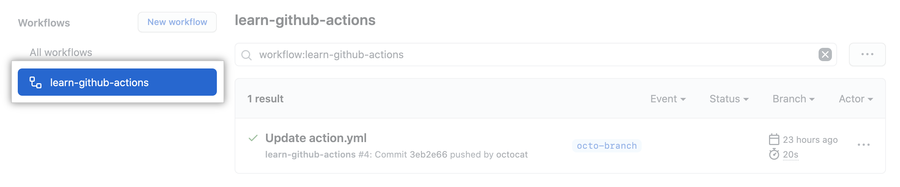

2. Under "Workflow runs", click the name of the run you want to see.

    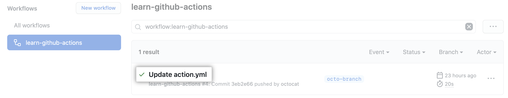

3. Under Jobs or in the visualization graph, click the job you want to see.

    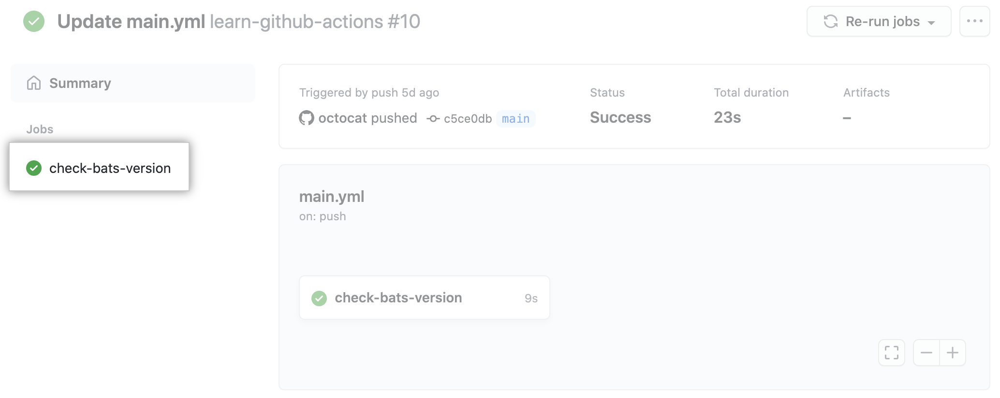

4. View the results of each step.

    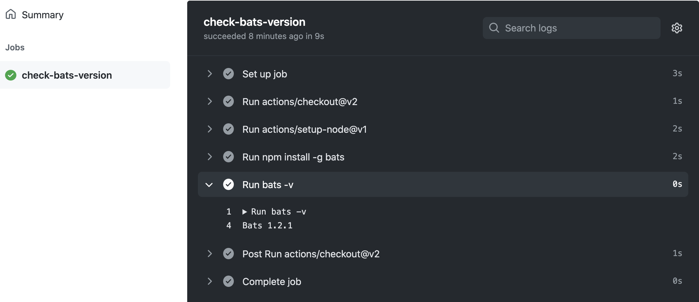

### Update environment variables
In case you have updated your repository and you are using a new environment variable, you have to update both your repository's caller workflow as well as the reusable workflow it refers to from [graasp-deploy](https://github.com/graasp/graasp-deploy). 

The environment variables are passed to the caller workflows as either inputs or secrets. You have to choose the approach that fits best. 

For this purpose, you need to perform the following steps. 

#### 1. Update inputs and secrets in the reusable workflow
The reusabe workflow is available in the `.github/workflows` folder in [graasp-deploy](https://github.com/graasp/graasp-deploy/tree/main/.github/workflows). 

Example: `cintegration-s3.yml` file.
```
on:
  workflow_call:
    # Define inputs which can be passed from the caller workflow
    inputs:
    // ...
      new-app-name:
        required: true
        type: string
    # Define secrets which can be passed from the caller workflow
    secrets:
    // ...
      new-app-secret:
        required: true
```

For more information on the appropriate input syntax, see Github Docs "[Workflow syntax](https://docs.github.com/en/actions/using-workflows/workflow-syntax-for-github-actions#onworkflow_call)". 

#### 2. Reference the input or secret that you defined in the previous step inside the appropriate job of the reusable workflow
Example: `cintegration-s3.yml` file.
```
jobs:
// ...
  build:
    needs: test
    name: Build
    runs-on: ubuntu-latest
    steps: 
    - name: Yarn build dev
      id: build-image
      # Set environment variables required to perform the build. These are only available to this step
      env: 
        NEW_APP_NAME: ${{ inputs.new-app-name }}
        NEW_APP_SECRET: ${{ secrets.new-app-secret }}
// ...
```

#### 3. Include the input/secret name in the caller workflow
The caller workflow is available in the `.github/workflows` folder in **your own** repository. 
- Use the `with` keyword to pass named inputs.
- Use the `secrets` keyword to pass named secrets. 

You should perform this step for:
- The caller workflow available in the `.github/workflows`folder of your repository. 
- The caller workflow template available in [graasp-deploy](https://github.com/graasp/graasp-deploy/tree/main/caller-workflow-templates). After you perform this step, please see [Update SHA reference of a caller workflow](#update-sha-reference-of-a-caller-workflow). 

Example: `cintegration-s3.yml` file.
````
jobs:
  graasp-deploy-s3-workflow:
    # Uses the workflow updated in the previous steps
    uses: graasp/graasp-deploy/.github/workflows/cintegration-s3.yml@main
    with:
      //...
      new-app-name: 'new app'
    secrets:
      //...
      new-app-secret: ${{ secrets.NEW_APP_SECRET }}
````

#### 4. Create secrets
If you decided to pass any of your new variables as a secret, you have to create a new secret for the specific repository. The secret must have the same name you specified in the previous step.
1. Navigate to the main page of the repository. 
2. Under the repository name, click Settings

    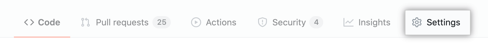

3. In the left sidebar, click  Secrets > Actions.

    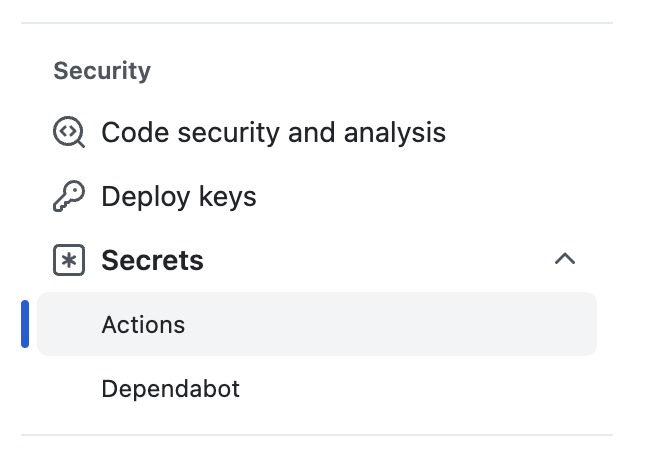
4. Click New repository secret.
5. Type a name for your secret in the Name input box. Example: `NEW_APP_SECRET`

    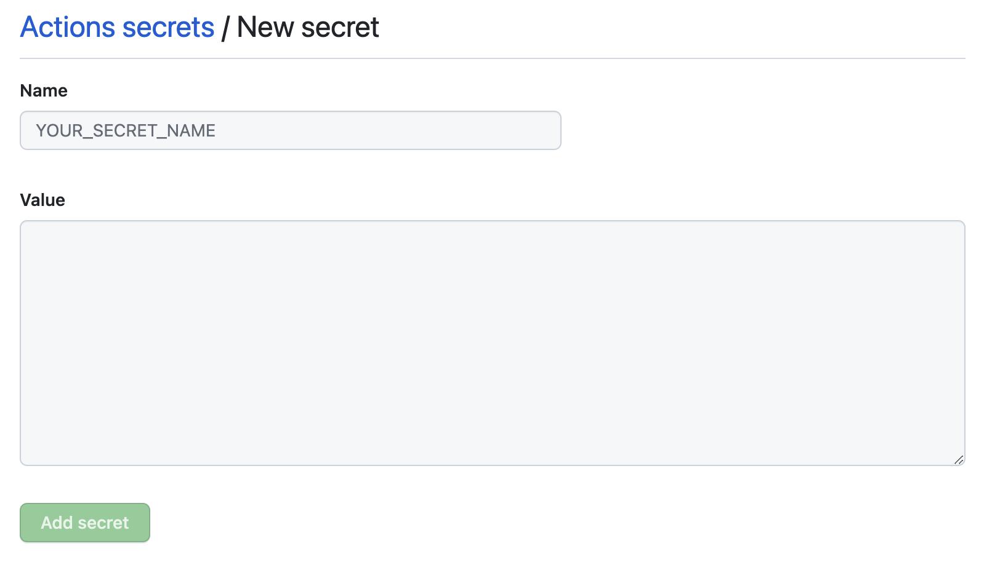
6. Enter the value for your secret.
7. Click Add secret.

For more information, see Github Docs "[Encrypted secrets](https://docs.github.com/en/enterprise-cloud@latest/actions/security-guides/encrypted-secrets)". 

### Update SHA reference of a caller workflow
It is important that whenever you perform an update on a reusable workflow, you update the SHA reference from the caller workflow that uses it. That is the commit hash from the last commit that includes the changes made to the reusable workflow. 

Inside your caller workfloes, you reference the reusable workflow files from graasp-deploy by using the following syntax:
```
graasp/graasp-deploy/.github/workflows/{filename}@{SHA}
```

For more information see [Why refer to a fixed workflow commit](#why-refer-to-a-fixed-workflow-commit)

## Why use Github Actions
The use of Github Actions simplifies the automation process. Actions are similar to a plugin that comes bundled for every Github repository created, and that can execute any desired task.

Github Actions embrace five underlying concepts: jobs, workflows, events, actions and runners. 


## Why use workflows

As stated in the [Github Docs](https://docs.github.com/en/actions/using-workflows/about-workflows):

>A workflow is a configurable automated process that will run one or more jobs. Workflows are defined by a YAML file checked in to your repository and will run when triggered by an event in your repository, or they can be triggered manually, or at a defined schedule.

## Why use reusable workflows

As stated in the [Github Docs](https://docs.github.com/en/actions/using-workflows/reusing-workflows): 
>The use of reusable workflows avoids duplication and makes workflows easier to maintain. This way workflows can be created more quickly. 

The main goal for Graasp Deploy is to build up a library of reusable workflows that can be centrally maintained.

For more information see Github Docs "[Reusing workflows](https://docs.github.com/en/actions/using-workflows/reusing-workflows)". 

## Why refer to a fixed workflow commit
It is a good practice to specify exactly what commit I want to use, as it points to an specific version of the reusable workflow that is used. Using the commit SHA is the safest for stability and security. 

Therefore, it’s safer to use it like this so if there are changes on the main branch, the hash always points to the same file, and you never have to worry about the action changing or behaving differently. 
